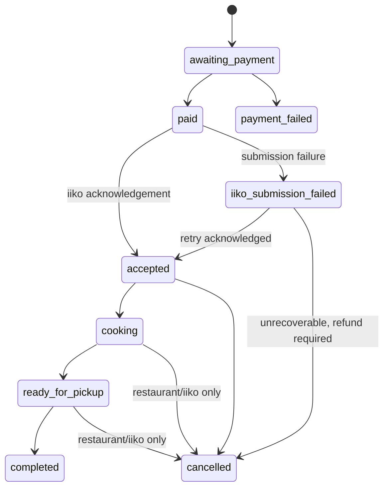

# Все Про Жар — Core Product Contracts

## 1. Purpose and Scope

Этот документ формализует критическое поведение первого release «Все Про Жар»:
инварианты, состояния, допустимые переходы, условия и product-level последствия
ошибок. Он предназначен для последующего проектирования API, DB, vertical slices,
acceptance criteria и automated tests.

[`product-definition.md`](./product-definition.md) остаётся higher-level source of
truth для product scope и owner decisions. Этот документ не выбирает API, DB schema,
конкретный iiko API, SBP provider или техническую реализацию. Если Product Definition
помечает решение как `TBD`, оно остаётся `TBD` и здесь.

**Contract rule:** future implementation MUST satisfy these contracts; it MUST NOT
infer additional product behaviour from the prototype.

## 2. System Sources of Truth

| Domain                 | Source of truth                             |
| ---------------------- | ------------------------------------------- |
| Product definition     | Product Definition                          |
| Product contracts      | Product documentation                       |
| Mobile visual design   | Prototype, within the approved visual scope |
| Menu content           | Admin/backend                               |
| Product prices         | Admin/backend                               |
| `admin_enabled`        | Admin/backend                               |
| Kitchen availability   | iiko                                        |
| Final checkout price   | Backend                                     |
| Payment confirmation   | SBP provider + backend persisted state      |
| Kitchen execution      | iiko                                        |
| Order persisted record | Backend                                     |
| Loyalty balance        | Backend                                     |
| XP/rank                | Backend                                     |
| Promo validity         | Backend                                     |
| API                    | Future OpenAPI                              |
| DB                     | Future migrations/schema                    |

### 2.1 Conflict behaviour

| Conflict                                                              | Required resolution                                              |
| --------------------------------------------------------------------- | ---------------------------------------------------------------- |
| Product documentation disagrees with prototype                        | Product documentation wins.                                      |
| Cached mobile price or availability disagrees with backend validation | Backend result wins; checkout uses the refreshed result.         |
| `admin_enabled` is false                                              | Product is not orderable even if iiko reports available.         |
| iiko reports unavailable                                              | Product is not orderable even if Admin enabled it.               |
| Payment provider event conflicts with an unverified client claim      | Provider confirmation persisted by backend wins.                 |
| Kitchen status conflicts with an Admin action                         | iiko owns kitchen execution; Admin does not perform that action. |

## 3. Core Monetary Rules

### 3.1 Monetary invariants

1. **MON-001:** All first-release prices, discounts, rewards and payments use RUB.
2. **MON-002:** Backend recalculates every checkout amount. A total supplied by
   mobile is display-only and never authoritative.
3. **MON-003:** Checkout uses current product prices, not a price retained in a cart
   or historical order.
4. **MON-004:** Promo and ember eligibility are validated server-side at checkout.
5. **MON-005:** One active promo is the maximum; promo and ember redemption are
   mutually exclusive.
6. **MON-006:** There is no minimum order amount.
7. **MON-007:** Tips, cutlery selection, service fee and packaging fee are absent.

### 3.2 Permitted checkout branches

| Branch | Preconditions                                | Conceptual total            |
| ------ | -------------------------------------------- | --------------------------- |
| Base   | No promo; no ember redemption                | `subtotal`                  |
| Promo  | Exactly one valid promo; no ember redemption | `subtotal - promo_discount` |
| Ember  | Valid ember redemption; no promo             | `subtotal - ember_discount` |

`subtotal` is the sum of current prices for valid cart items before discounts.
`promo_discount` and `ember_discount` are backend-calculated RUB amounts. A gift
promo is validated by backend; its exact item/price effect is not specified here.
No floating-point representation or implementation approach is prescribed.

## 4. Product Availability Contract

```text
product_is_orderable = admin_enabled AND iiko_available
```

| Moment                      | Required behaviour                                                                        |
| --------------------------- | ----------------------------------------------------------------------------------------- |
| Catalog display             | Show the current product availability derived from the formula above.                     |
| Add/change cart             | A product that is not orderable MUST NOT become an orderable cart line.                   |
| Periodic operation          | iiko stop-list availability is synchronized periodically.                                 |
| Before payment              | Backend performs an authoritative current-availability recheck.                           |
| Product becomes unavailable | Customer MUST correct the cart; payment and order creation are blocked until it is valid. |

Warehouse inventory is not part of this contract.

## 5. Cart Contract

| Rule                      | Contract                                                                                                                |
| ------------------------- | ----------------------------------------------------------------------------------------------------------------------- |
| Persistence               | A guest cart survives application closure and authentication.                                                           |
| Authentication transition | Authentication MUST NOT discard a guest cart.                                                                           |
| Quantity                  | A cart line has a quantity; checkout uses the current quantity and current price.                                       |
| Comment                   | Cart supports one common order comment, not per-item comments.                                                          |
| Recalculation             | Price, availability, promo and ember effects are revalidated before payment.                                            |
| Repeat order              | Recreates a cart from current products, current prices and current availability; it MUST NOT restore historical prices. |
| Repeat-order failure      | Removed, changed or unavailable products require cart correction before checkout.                                       |

## 6. Authentication Boundary

```text
Guest → cart → checkout → authentication required → SMS OTP
→ authenticated customer → return to checkout
```

| Boundary           | Contract                                                                |
| ------------------ | ----------------------------------------------------------------------- |
| Guest capabilities | Browse menu, local search, build a cart, apply promo and open checkout. |
| Order creation     | Forbidden without an authenticated customer.                            |
| Authentication     | Phone + SMS OTP is required for order creation. SMS provider is TBD.    |
| Cart continuity    | The cart MUST survive the authentication transition.                    |
| Customer data      | Name is required at the first order; birthday is optional.              |

Password, email, Apple Sign In and Google Sign In are out of scope for the first
release.

## 7. Checkout Preconditions

Payment MUST NOT start unless every applicable condition below is true.

| ID      | Required precondition                                                              |
| ------- | ---------------------------------------------------------------------------------- |
| CHK-001 | Customer is authenticated.                                                         |
| CHK-002 | Restaurant currently accepts orders.                                               |
| CHK-003 | Pickup mode and selected pickup time are valid.                                    |
| CHK-004 | Cart is not empty.                                                                 |
| CHK-005 | Every cart product exists and is `admin_enabled`.                                  |
| CHK-006 | Every cart product is currently `iiko_available`.                                  |
| CHK-007 | Current prices have been refreshed and total recalculated by backend.              |
| CHK-008 | The selected promo or ember redemption is valid; both are never selected together. |
| CHK-009 | iiko is sufficiently available to accept a new order.                              |

Failure of any precondition blocks payment initiation and leaves no unpaid order for
iiko submission.

## 8. Pickup Time Contract

| Subject                 | Contract                                                                                     |
| ----------------------- | -------------------------------------------------------------------------------------------- |
| Location                | One fixed pickup location: Краснодар, ул. Бабушкина, 181. No branch selection.               |
| Day                     | Pickup is available only on the current day. Next-day ordering is unavailable after closing. |
| Modes                   | `ASAP` or scheduled pickup in one-hour slots.                                                |
| Latest scheduled pickup | No later than 22:00.                                                                         |
| Preparation time        | Configured by Admin.                                                                         |
| ASAP                    | Does not require automatic calculation through a mandatory minimum-preparation duration.     |
| Late time               | `ASAP` may be valid at 21:40.                                                                |
| After 21:30             | New orders are blocked if `ASAP` is unavailable.                                             |

The exact algorithm for the 21:30–22:00 boundary is **TBD**. This contract does not
introduce a formula for it.

## 9. Payment Lifecycle

### 9.1 Conceptual payment states

| State              | Meaning                                                            | Allowed next states                                |
| ------------------ | ------------------------------------------------------------------ | -------------------------------------------------- |
| `awaiting_payment` | Valid checkout has initialized payment; payment is not confirmed.  | `paid`, `failed`, `expired`                        |
| `paid`             | Provider confirmation has been processed and persisted by backend. | order submission path, refund path when applicable |
| `failed`           | Payment did not succeed.                                           | terminal for the payment attempt                   |
| `expired`          | Payment did not complete before the provider timeout.              | terminal for the payment attempt                   |
| `refund_pending`   | A required full refund is being processed.                         | `refund_succeeded`, `refund_failed`                |
| `refund_succeeded` | Full refund completed.                                             | terminal                                           |
| `refund_failed`    | Refund did not complete.                                           | critical incident handling                         |

### 9.2 Required flow

```text
validated checkout → payment initialized → banking application
→ provider confirmation → backend confirmation → paid
```

Provider callbacks/webhooks MUST be conceptually idempotent and retry-safe. An unpaid,
failed or expired payment MUST NOT result in iiko submission. Exact provider and exact
timeout remain **TBD**; the approved expectation is approximately 10–15 minutes.

## 10. Order Lifecycle

`accepted` semantics are **TBD**. The table expresses only approved boundaries, not a
technical event model.

| Order state / condition           | Meaning                                                                       | Source                                | Customer visibility                     | Allowed next states or outcome                                                        |
| --------------------------------- | ----------------------------------------------------------------------------- | ------------------------------------- | --------------------------------------- | ------------------------------------------------------------------------------------- |
| `awaiting_payment`                | Checkout passed and payment is pending.                                       | Backend/payment flow                  | Payment pending                         | `paid`, `payment_failed`, expired payment path                                        |
| `paid`                            | Payment confirmed by backend; kitchen acknowledgement is not yet claimed.     | Backend persisted payment             | Paid; no false kitchen acceptance       | `accepted`, internal iiko submission failure, `cancelled` with refund when applicable |
| `accepted`                        | Kitchen-accepted state after iiko acknowledgement; exact semantic detail TBD. | iiko acknowledgement/backend          | May be shown only after acknowledgement | `cooking`, `cancelled`                                                                |
| `cooking`                         | Kitchen execution has begun.                                                  | iiko                                  | Cooking                                 | `ready_for_pickup`, `cancelled` by restaurant/iiko                                    |
| `ready_for_pickup`                | Order is ready for customer pickup.                                           | iiko                                  | Ready                                   | `completed`, `cancelled` by restaurant/iiko                                           |
| `completed`                       | Pickup/order completion reported by iiko.                                     | iiko                                  | Completed                               | terminal                                                                              |
| `payment_failed`                  | Payment failed or payment path ended without confirmation.                    | Payment/backend                       | Payment failed                          | terminal                                                                              |
| `cancelled`                       | Order was cancelled with a stable reason.                                     | Customer, restaurant, iiko or backend | Cancelled with human-readable reason    | terminal; refund path if paid                                                         |
| internal `iiko_submission_failed` | Paid order has not been accepted by iiko because submission failed.           | Backend integration record            | Never represented as false `accepted`   | bounded retries, then cancellation/refund path                                        |



The diagram deliberately does not resolve the exact semantics of `accepted` or the
payment-expiration-to-order-state implementation detail.

## 11. iiko Submission Contract

```text
backend persists order → payment confirmed → submit to iiko
→ iiko acknowledgement → customer may see accepted kitchen state
```

1. iiko submission before confirmed payment is forbidden.
2. If iiko is unavailable before payment, checkout and payment are blocked.
3. Backend persists the order record; iiko executes the kitchen order.
4. Customer MUST NOT see an accepted kitchen state before iiko acknowledgement.
5. iiko is the source of cooking, readiness and completion status.

## 12. iiko Failure Contract

For `payment = succeeded` and `iiko submission = failed`:

| Required result       | Contract                                                                                         |
| --------------------- | ------------------------------------------------------------------------------------------------ |
| Durable record        | The order and payment MUST NOT disappear; integration failure is recorded.                       |
| Retry                 | Backend performs bounded automatic retries. Retry count and timeout are TBD technical decisions. |
| Alerting              | A critical alert is generated.                                                                   |
| Customer truthfulness | Customer MUST NOT receive a false accepted state.                                                |
| Unrecoverable result  | Automatic full refund is required.                                                               |

## 13. Cancellation Contract

| Initiator / state              | Allowed? | Required result                                            |
| ------------------------------ | -------- | ---------------------------------------------------------- |
| Customer before `cooking`      | Yes      | Cancel with `customer_request`; full refund when paid.     |
| Customer at or after `cooking` | No       | Customer cancellation is forbidden.                        |
| Restaurant or iiko             | Yes      | Cancel with an applicable stable reason; refund when paid. |

The stable cancellation-reason set is:

```text
customer_request | item_unavailable | restaurant_issue | payment_issue | other
```

Customer-facing cancellation information MUST be human-readable.

## 14. Refund Contract

| Rule                          | Contract                                                                   |
| ----------------------------- | -------------------------------------------------------------------------- |
| Eligible paid cancellation    | Requires full refund.                                                      |
| iiko unrecoverable after paid | Requires automatic full refund.                                            |
| States                        | `refund_pending` → `refund_succeeded` or `refund_failed`.                  |
| Refund failure                | Critical incident; Telegram alert and super-admin visibility are required. |

Provider-specific refund API behaviour is **TBD**.

## 15. Order History Contract

Every order-status transition MUST be persisted with at least:

| Field          | Required meaning            |
| -------------- | --------------------------- |
| `from`         | Previous status             |
| `to`           | New status                  |
| `timestamp`    | Time of the transition      |
| `source/actor` | Originating actor or system |

When an external event has a reference, the history SHOULD retain it. Admin can view
order history. This document does not prescribe distributed tracing design.

## 16. Promo Contract

| Subject             | Contract                                                                                                                     |
| ------------------- | ---------------------------------------------------------------------------------------------------------------------------- |
| Types               | `percent`, `fixed`, `gift`                                                                                                   |
| Scope               | Entire order, category or product                                                                                            |
| Maximum             | At most one active promo                                                                                                     |
| Combination         | Promo + embers is forbidden                                                                                                  |
| Validation          | Backend revalidates at checkout                                                                                              |
| Admin configuration | `valid_from`, `valid_until`, minimum subtotal, one-use-per-user, first order, usage limit and applicable products/categories |

An invalid promo is rejected before payment; it cannot produce a discount merely
because it was previously displayed in mobile.

## 17. Ember Contract

| Rule              | Contract                                                                              |
| ----------------- | ------------------------------------------------------------------------------------- |
| Nature            | Угольки are spendable loyalty currency, distinct from XP.                             |
| Redemption cap    | Default maximum payment is 30%; Admin controls this configuration.                    |
| Cashback          | Rank-dependent.                                                                       |
| Award point       | Only after `completed`.                                                               |
| Cancel/refund     | No reward for cancelled order; a refund/reversal reconciles previously issued reward. |
| Expiration        | Configurable by Admin.                                                                |
| Manual adjustment | Requires amount, reason, actor and timestamp.                                         |

Accounting implementation is not specified.

## 18. XP and Rank Contract

| Subject                | Contract                                |
| ---------------------- | --------------------------------------- |
| XP                     | Separate from embers and not spendable. |
| Award point            | Only after `completed`.                 |
| Cancel/refund          | Progression is reconciled.              |
| Formula                | Configured by Admin.                    |
| Manual XP adjustment   | Forbidden.                              |
| Ranks                  | Configured by Admin and grant benefits. |
| Confirmed rank benefit | Cashback.                               |
| Other rank benefits    | TBD.                                    |

## 19. Wheel Contract

| Rule            | Contract                                                              |
| --------------- | --------------------------------------------------------------------- |
| Eligibility     | One completed qualifying order with eligible amount ≥ 1000 RUB.       |
| Threshold basis | After discounts. Interaction with ember redemption is TBD.            |
| Maximum         | One spin per qualifying order; a 2500 RUB order still gives one spin. |
| Issuance        | After `completed`; spins do not accumulate.                           |
| Reward          | Every spin has a reward.                                              |
| Reward types    | Embers, XP, promo or free product.                                    |
| Administration  | Admin configures rewards and probabilities.                           |

## 20. Quest Contract

| Field / rule   | Contract                                                       |
| -------------- | -------------------------------------------------------------- |
| Quest fields   | Condition, progress, reward, start date, end date.             |
| Examples       | N orders, N spend, product purchase, N orders within a period. |
| Concurrency    | Multiple active quests are allowed.                            |
| Reward         | Issued automatically.                                          |
| Administration | Admin configures quests.                                       |

## 21. Notification Contract

| Class              | Events / rules                                                                                     |
| ------------------ | -------------------------------------------------------------------------------------------------- |
| Transactional push | `paid`, `accepted`, `cooking`, `ready_for_pickup`, `cancelled`, refund completed, `payment_failed` |
| Marketing push     | Promos, new products, embers, quests, wheel and campaigns                                          |
| SMS                | OTP only                                                                                           |
| Email              | Not used                                                                                           |

Marketing consent and the stated inability to separately disable marketing push remain
an unresolved **TBD**; this contract does not resolve that conflict.

## 22. Offline Contract

| Capability                 | Offline behaviour                                                             |
| -------------------------- | ----------------------------------------------------------------------------- |
| Cached categories and menu | Allowed to browse.                                                            |
| Local search               | Allowed over cached menu data.                                                |
| Checkout                   | Forbidden.                                                                    |
| Payment                    | Forbidden.                                                                    |
| Order creation             | Forbidden.                                                                    |
| Cached price/availability  | Never authoritative for checkout; backend validation is required when online. |

## 23. Admin vs iiko Responsibility Boundary

| Capability                         | Admin         | iiko |
| ---------------------------------- | ------------- | ---- |
| Menu content                       | YES           | NO   |
| Prices                             | YES           | NO   |
| Admin visibility                   | YES           | NO   |
| Stop-list operational availability | NO            | YES  |
| Kitchen order processing           | NO            | YES  |
| Cooking status                     | Observer only | YES  |
| Completion                         | Observer only | YES  |
| Promo                              | YES           | NO   |
| Loyalty                            | YES           | NO   |
| Gamification                       | YES           | NO   |

Admin MUST NOT duplicate operational kitchen actions owned by iiko.

## 24. Critical Invariants

| ID      | Invariant                                                                   |
| ------- | --------------------------------------------------------------------------- |
| INV-001 | Backend is the final-price authority.                                       |
| INV-002 | An unauthenticated user cannot create an order.                             |
| INV-003 | Offline checkout, payment and order creation are forbidden.                 |
| INV-004 | An unpaid order cannot be sent to iiko.                                     |
| INV-005 | Kitchen acceptance cannot be claimed before iiko acknowledgement.           |
| INV-006 | A product that is not `admin_enabled AND iiko_available` cannot be ordered. |
| INV-007 | Promo and embers cannot be combined.                                        |
| INV-008 | Loyalty and XP are awarded only after `completed`.                          |
| INV-009 | Customer cancellation is forbidden once `cooking` begins.                   |
| INV-010 | Unrecoverable paid-to-iiko submission failure requires refund.              |
| INV-011 | Every order-status transition is recorded.                                  |
| INV-012 | Admin does not duplicate iiko kitchen actions.                              |
| INV-013 | Repeat order uses current price and availability, never historical prices.  |
| INV-014 | Payment cannot start while any checkout precondition fails.                 |
| INV-015 | A wheel spin is non-accumulating and always has a reward.                   |

## 25. Failure Matrix

| Failure                                   | Expected product result                                           |
| ----------------------------------------- | ----------------------------------------------------------------- |
| Product unavailable                       | Block checkout until cart correction.                             |
| Price changed                             | Recalculate with current backend price; require updated checkout. |
| Promo invalid                             | Reject promo; do not start payment until checkout is valid.       |
| Offline                                   | Block checkout, payment and order creation.                       |
| iiko unavailable before payment           | Block checkout and payment.                                       |
| Payment failed                            | Do not submit an iiko order.                                      |
| Payment timeout                           | Expire the payment/order path; do not submit an iiko order.       |
| Payment succeeded, iiko temporarily fails | Record failure, bounded retry, no false accepted state.           |
| iiko failure is unrecoverable             | Automatic full refund.                                            |
| Refund failed                             | Critical alert, Telegram alert and super-admin visibility.        |
| Product unavailable during repeat order   | Require cart correction before checkout.                          |

## 26. Open Questions / TBD

- Exact iiko API and integration details.
- Concrete SBP provider.
- Exact payment expiration timeout within the approximately 10–15 minute expectation.
- Exact semantics of `accepted`.
- Admin authentication mechanism.
- Exact additional rank benefits beyond cashback.
- Marketing consent and notification-preference conflict.
- Exact pickup closing-boundary algorithm between 21:30 and 22:00.
- Modifiers: structure, min/max, pricing and exclusions.
- Combo/set rules and behaviour.
- Wheel threshold interaction with ember redemption.
- Future delivery product details; delivery is not part of the first release.
